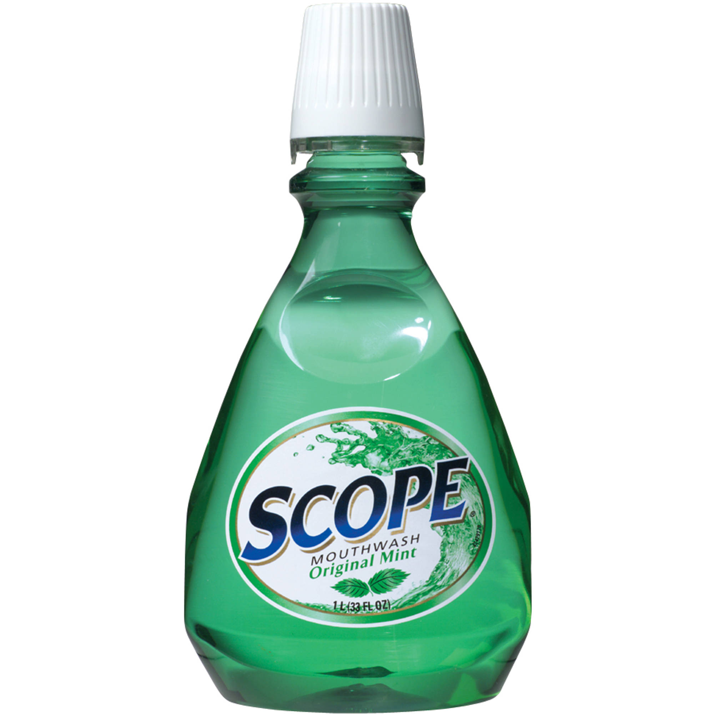

# Functions

## What is a function?

_A reusable piece of code that will encapsulate a particular behavior for later use._

## How are functions utilized?

_Functions are used to store behavior for later use much like variables store values for later use_

## When to create a function?

_When you are executing behavior more than one time_

## Benefits

- You can avoid repeating yourself
- You can code complex behavior and reuse it later more than one time

## Some Definitions

- __function name:__ the name of the function for later use
- __parameter:__ the variable names defined when creating a function
  - you can define a function with no parameters
- __arguments:__ the values being passed into the function on invocation
  - when a function definition has no parameters you can pass in no arguments
- __return value:__ the value that the function outputs
  - you can have a function without a return value
  - you can have multiple return statements within a function

## Syntax

### Definition
```js
// paramOne and paramTwo are parameters
function addAndMultiplyByTwo(paramOne, paramTwo) {
  return paramOne + paramTwo * 2
}

// array is a parameter
function logArrayWithWords(array) {
  for(let i = 0; i < array.length; i++) {
    console.log(`The value of index ${i} is ${array[i]}`)
  }
}

// no parameters
function displayMyName() {
  return "Orlando Caraballo"
}
```

### Invocation

```js
// 4 and 5 are arguments
addAndMultiplyByTwo(4, 5) // 18

// the newly created array is the ONLY argument
logArrayWithWords([21, 22, 23])
/*
  This code would log the following to the console:
    The value of index 0 is 21
    The value of index 1 is 22
    The value of index 2 is 23
*/

displayMyName() // Orlando Caraballo
```

### Arguments vs Parameters

_**Parameters** are the variables you define for a function_

_**Arguments** are the values that you assign to the parameters_

## Calling functions within functions

_You can invoke a functions within another function_

```js
function multiplyByThree(number) {
  return number * 3
}

function addTwo(number) {
  return number + 2
}

function addTwoMultiplyByThree(number) {
  return multiplyByThree(addTwo(number))
}

addTwoMultiplyByThree(10) // 36
addTwoMultiplyByThree(2) // 12
```

## Scope



^ No not that scope...

_Scope defines what variables you have access to at any given point_

The major types are:
- __Global Scope:__ when a variable is accessible in the entire program
- __Local Scope:__ when a variable is accessible within a specific part of your code

### Global Scope

```js
let name = "orlando"

function scopeCheck() {
  // name is available in this function
  return name + " caraballo"
}

scopeCheck() // orlando caraballo

let name = "denisse" // will give you an error because it's already defined in the global scope
```

__Note: Avoid creating variables with global scope because you can run into issues with naming__


### Local Scope

There are two major categories within local scope:
- Function scope
- Block scope


#### Function Scope

```js
// the parameter number is only available within this function
function subtractBySeven(number) {
  return number - 7
}

console.log(number) // ReferenceError: number is not defined
```

#### Block Scope

```js
{
  // value is only available in this block
  // this also applies to if statements, for, while, etc
  //  basically anything with a { .. }
  const value = 8
}

console.log(value) // ReferenceError: value is not defined
```

## Name Collision

If you redefine a function after its been defined, it will override the original definition

```js
function returnName() {
  return "orlando"
}

function returnName() {
  return "fizal"
}

// avoid doing this because you can confuse yourself
returnName() // fizal
```

[CSS Tricks: Javascript Scope](https://css-tricks.com/javascript-scope-closures/)

## Hoisting

_The concept of hoisting was created by developers to explain what happens during the compilation phase when variables and function declarations are moved — or hoisted — to the top of their containing scope_

```js
function petName(name) {
  return "My pet's name is " + name
}

// this works
petName("Optimus Prime")
```

```js
// this also works
petName("Optimus Prime")

function petName(name) {
  return "My pet's name is " + name
}
```


_Javascript will do a first pass to hoist all declared functions in the program first before interpreting the rest of the code. This makes functions available for use lines above where you define them._

[MDN Glossary: Hoisting](https://developer.mozilla.org/en-US/docs/Glossary/Hoisting)

## Callback functions

_Welcome to the Big Leagues!_

```js
function add(argument1, argument2) {
  return argument1 + argument2
}

function multiply(argument1, argument2) {
  return argument1 * argument2
}

function doTwoThings(argument1, argument2, firstFunction, secondFunction) {
  return secondFunction( firstFunction(argument1, argument2), 5)
}

doTwoThings(2, 3, add, multiply)
```

## Anonymous functions

Functions can be created without a name

```js
function() {
  // some code in here
}
```

You may also see this pattern

```js
const returnName = function() {
  return "orlando"
}
```

For this reason

```js
const returnName = function() {
  return "orlando"
}

// this will not execute
function returnName() {
  return "fizal"
} // SyntaxError: Duplicate declaration "returnName"
```

Anonymous functions are useful for passing in callbacks into functions

```js
function runCodeOnNumber(specialFunction) {
  let number = 2

  return specialFunction(number)
}

runCodeOnNumber(function(number){
  return number + 5
}) // 7

runCodeOnNumber(function(number){
  return number * 20
}) // 40
```

## Functions Within Functions

_Let's go deeper_


```js
function functionWithinAFunction() {
  function logStuff() {
    console.log("Logging stuff")
  }

  return logStuff()
}

functionWithinAFunction()
```

## Closures

_Any variables defined within a function are also accessible in functions declared inside that same function_

```js
function functionWithinAFunction() {
  let number = 4

  function logNumber() {
    console.log(number)
  }

  return logNumber() // 4
}

functionWithinAFunction()
```

_Let's go H.A.M!_

```js
function functionWithinAFunction() {
  let listOfNumbers = [1,7,4,5]

  function displayAndSumNumbers() {
    let sum = 0

    for(let i = 0; i < listOfNumbers.length; ++i) {
      console.log(`The current number is ${listOfNumbers[i]}`)

      sum += listOfNumbers[i]
    }

    return sum
  }

  return displayAndSumNumbers()
}

console.log(`The total sum is ${functionWithinAFunction()}`) //
```

## Recursive Functions - _Welcome to the Final Frontier!_


You can also invoke the same function within itself

```js
// WE WILL NOT BE REQUIRING YOU KNOW THIS BUT...
//  IT IS PRETTY COOL
function recursiveSum(array) {
  if(array.length == 1) {
    // if its down to the last element then return
    return array[0]
  }
  
  // gets removes the first element of the array
  array = array.slice(1)
  
  return array[0] + recursiveSum(array)
}

// wut D-:
recursiveSum([1,2,3,4,5]) // 19
```

## Workshop

[Functional Javascript](https://drive.google.com/open?id=1VdC1RMjluK_4IGpnHnpVIASdTdCBpbbaQkxIPO2JUEc)

### Resource

[MDN: Functions](https://developer.mozilla.org/en-US/docs/Web/JavaScript/Reference/Functions)