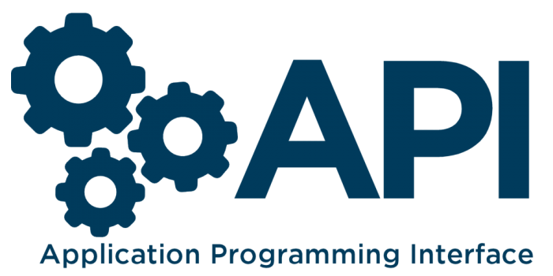

# Understanding APIs

- Stands for __Application Programming Interface__
- Allows us to retrieve information or modify information stored on a server

## Forms

_Forms can allow us to retrieve data from the user to submit to an API_

HTML Attributes
- __method__ - the type of request method (e.g _GET | POST | PUT / PATCH | DELETE_)
- __action__ - where the information will be submitted to (e.g. http://swapi.co/people/1)

## RESTful API

[MLSDev: Understanding RESTful API](https://mlsdev.com/blog/81-a-beginner-s-tutorial-for-understanding-restful-api)

## API Examples

- [Star Wars](https://swapi.co/)
- [Star Trek](http://stapi.co/)
- [OMDB](http://www.omdbapi.com/)
- [Open Weather](https://openweathermap.org/api)

## API Wrappers

_An API wrapper is a library that is coded specifically for simplifying API requests to a target API_

### Examples
- [Twitter API Wrappers](https://developer.twitter.com/en/docs/developer-utilities/twitter-libraries)
- [Star Wars API](https://swapi.co/documentation)

## Data points

_A specific resource that is available for consumption via an API_

## Endpoint

_The url you must hit in order to retrieve a specific data point from an API_

### Examples
- Pokemon API - has a `pokemon/[id]` endpoint to retrieve information on the pokemon data point
- Star Wars API - has a `people/[id]` endpoint to retrieve information on the person data point

## Tools
- [Postman](https://www.getpostman.com/)
- [cURL](https://www.learnhowtoprogram.com/javascript/asynchrony-and-apis-in-javascript/testing-api-calls-with-curl)
- [Insomnia](https://insomnia.rest/)
- Chrome Network Tab

## Workshop
[Github HUD](https://docs.google.com/document/d/1DDeJw9YeEOdweDiB4YlsoP9w8wSFt9D4kGj7MqgqKxs/edit)