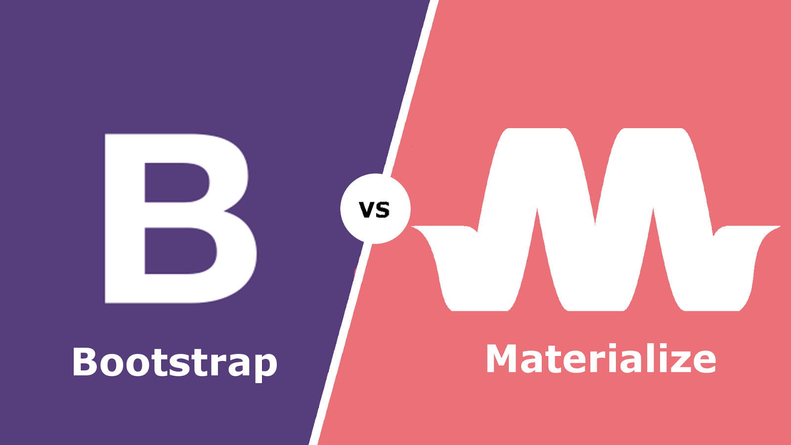
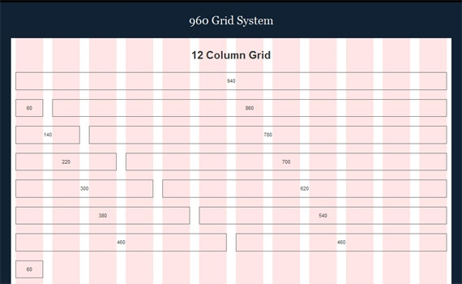

# Introduction to Frameworks

## What is a Framework

_A web framework or web application framework is a software framework that is designed to support the development of web applications including web services, web resources, and web APIs. Web frameworks provide a standard way to build and deploy web applications. Web frameworks aim to automate the overhead associated with common activities performed in web development_

## Framework vs library

_Libraries provide standard code tools for a programming language whereas Frameworks also provide a standardized structure for your code alongside its tools_

## Advantages

- Don't have to code it yourself
- Utilities are built in
- Components
- Themes

## Disadvantages

- Adds complexity
- Code bloat
- You have to work within the framework capabilities

## Examples of Frontend Frameworks

- React
- Angular
- Vue.js
- Polymer
- Ember

## Backend Frameworks

- Sinatra (Ruby)
- Spring (Java)
- Ruby on Rails (Ruby)
- Laravel (PHP)
- Code Igniter (PHP)
- Django (Python)

## Frontend Visual Frameworks
- [Materialize](http://materializecss.com/)
- [Bootstrap](https://getbootstrap.com/)
- [Skeleton](http://getskeleton.com/)
- [Foundation](https://foundation.zurb.com/)

## Grid systems

### Simple Layout


### Complex Layout


### What is a grid system?

_A grid system provides a standard width grid layout for a website that can be created by utilizing special classes provided by a frontend visual framework_

Grid systems define css classes for both:
- Rows
- Columns

### Example

```html
<div class="row">
      <div class="col s1">1</div>
      <div class="col s1">2</div>
      <div class="col s1">3</div>
      <div class="col s1">4</div>
      <div class="col s1">5</div>
      <div class="col s1">6</div>
      <div class="col s1">7</div>
      <div class="col s1">8</div>
      <div class="col s1">9</div>
      <div class="col s3">10-12</div>
    </div>
```

### Advantages

- You don't have to code the system yourself 
- Takes care of mobile
- Can gain advantages of dedicated developer's work
- Common display bugs are already solved problems

### Disadvantages

- Adds complexity
- Code bloat
- You have to work within the grid system architecture
- Flexibility

## Workshop

[Just Mockery](https://drive.google.com/open?id=1dMFzofpjUKETl_fxu9tPygqJ9zIv5gtN7XJqLu4-qpk)