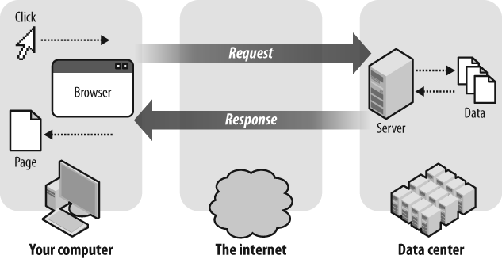
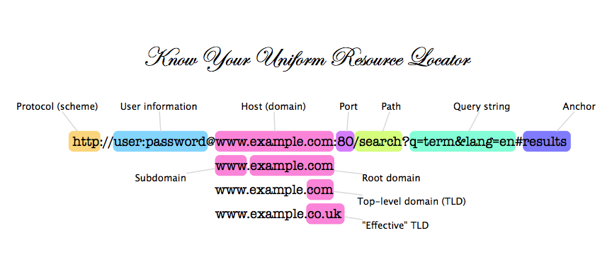

## What is a Framework?

A software framework, in computer programming, is an abstraction in which common code providing generic functionality can be selectively overridden or specialized by user code providing specific functionality. Frameworks are a special case of software libraries in that they are reusable abstractions of code wrapped in a well-defined Application programming interface (API), yet they contain some key distinguishing features that separate them from normal libraries.

Software frameworks have these distinguishing features that separate them from libraries or normal user applications:

- **inversion of control** - In a framework, unlike in libraries or normal user applications, the overall program's flow of control is not dictated by the caller, but by the framework.[1]
- **default behavior** - A framework has a default behavior. This default behavior must actually be some useful behavior and not a series of no-ops.
- **extensibility** - A framework can be extended by the user usually by selective overriding or specialized by user code providing specific functionality.
- **non-modifiable framework code** - The framework code, in general, is not allowed to be modified. Users can extend the framework, but not modify its code.

-- [Wikipedia: Software Framework](https://en.wikipedia.org/wiki/Software_framework)

## Wait... I thought APIs Were for Data

**API** stands for _application programming interface_ and it can be best described as providing an _interface for programming applications_.

The following is an psuedocoded API for representing NYCDA in code:

```javascript
// ECMAScript 2015 class style
class NYCDA {
  constructor() {
    // sets the hours
    this.hours = 24
  }
  
  openDoors() {
    // opens the school
  }

  closeDoors() {
    // closes the school
  }

  startClass(cohort, date) {
    // starts the class
  }

  endClass(cohort, date) {
    // ends the class
  }

  hoursOpen() {
    return `The school is open ${this.hours} hours a day`
  }

  createCohort(course, startDate, endDate) {
    // creates a cohort
  }
}

// prototypal style
function NYCDA() {
  this.hours = 24
}

School.prototype.openDoors() {
  // opens the school
}

School.prototype.closeDoors() {
  // closes the school
}

School.prototype.startClass(cohort, date) {
  // starts class
}

School.prototype.endClass(cohort, date) {
  // ends class
}

School.prototype.hoursOpen() {
  return `The school is open ${this.hours} hours a day`
}

School.prototype.createCohort(course, startDate, endDate) {
  // creates a cohort
}

// it's beneficial to interface with an object that represents
//  a school like NYCDA because we do not need to know the implementation details
//  to get some stuff done

nycda = new NYCDA()
nycda.hours // 24
nycda.createCohort("sei", "march 5", "june [can't remember the date]")

nycda.openDoors() // opens the school
nycda.startClass("edge-case", "today") // opens the school
nycda.endClass("edge-case", "today") // opens the school
nycda.closeDoors() // closes the school
```

The following is an psuedocoded API for representing a computer in code:

```ruby
class Computer
  def initialize
    @on = false
  end

  def turn_on
    @on = true
  end

  def turn_off
    @on = false
  end

  def run_ruby_file(code)
    # runs ruby code
    # this is running as if its on the terminal
    `ruby #{filename}` unless is_busy?
  end

  def run_js_file(code)
    # runs js code
    # this is running as if its on the terminal
    `node #{filename}` unless is_busy?
  end

  def is_on?
    @on
  end

  private 

  def is_busy?
    # check if computer is busy
  end
end

# its a lot easier to interface with an object that represents
#   a computer, and limit a user's capabilities, than to expose everything
#   and have to account for every scenario possible on a computer
macbook = Computer.new
macbook.turn_on
macbook.run_js_file("app.js")
macbook.run_ruby_file("app.rb")
macbook.turn_off
```

## Why Do We Use Frameworks?

_We use frameworks because we want to keep our code **DRY**. There are patterns that emerge in programming on the web that historically we would recode time and time again. A framework provides the needed structure for our applications whereas the developer can focus on the implementation details._

### StackOverflow Example


"I'm very late to answer it. But, I would like to share one example, which I only thought of today. If I told you to cut a piece of paper with dimensions 5m by 5m, then surely you would do that. But suppose I ask you to cut 1000 pieces of paper of the same dimensions. In this case, you won't do the measuring 1000 times; obviously, you would make a frame of 5m by 5m, and then with the help of it you would be able to cut 1000 pieces of paper in less time.

So, what you did was make a framework which would do a specific type of task. Instead of performing the same type of task again and again for the same type of applications, you create a framework having all those facilities together in one nice packet, hence providing the abstraction for your application and more importantly many applications."

-- [Stack Overflow: Lance Ashdown](https://stackoverflow.com/a/12733126)

## Types of Frameworks

- Front-end Frameworks
  - CSS /  JS Frameworks
  - JS Frameworks
- Micro-Frameworks
- Full-Stack Frameworks

## Frontend Framework

_Frontend frameworks are oftentimes difficult to describe because the definition is oftentimes nebulous and/or has been defined poorly. I define a css / js framework as code that provides a a foundation for you to build your view layer on the client side. JS only frameworks provide the foundation to build your client side javascript code._

CSS / JS Framework Examples
- Bootstrap
- Foundation
- Materialize

JS Framework
- React.js
- Angular.js
- Vue.js

## Full-Stack Framework

_A full-stack framework is a framework that attempts to provide nearly everything — from web serving to database management right down to HTML generation — that a developer could possibly need to build an application. It likely includes components that may not be needed by the majority of applications, but having them available makes it easier to integrate new features._


Examples
- Ruby
  - Ruby on Rails
- Java
  - Spring
- Python
  - Django
- Javascript
  - Meteor.js
  - Sails.js
- PHP
  - Laravel

## Micro-Frameworks

_A microframework is a framework that attempts to provide only the components that are absolutely necessary for a developer to build an application; or it may focus on providing the functionality of one particular area very efficiently._


  - Ruby
    - Sinatra
    - Cuba
    - Padrino
  - Python
    - Flask
  - Javascript
    - Express.js
  - PHP
    - Lumen

## HTTP Request / Response Review (YES... AGAIN)



Remember the acronym CRUD:

- **C**reate -> POST - creates resources
- **R**ead -> GET - gets resources
- **U**pdate -> PUT / PATCH - updates resources
- **D**elete -> DELETE - deletes resources

## URL Review

Let's reflect on some terms we've used before:



[MDN: What is a URL?](https://developer.mozilla.org/en-US/docs/Learn/Common_questions/What_is_a_URL)

## Introduction to Routing

_Routing is the process whereby an application specifies how to direct a client to a resource located on a server based on the url_

2 Steps to Proper Routing
- Define the route
- Define what the route does

Every route has a:
- **method** - associated with it that defines which http verb we will be using and an...
- **action** - which dictates what happens when a client is routed to this url as well as a...
- **path** - that dictates what url path to respond to

_**Note:** Methods, actions and paths are heavily related. Every **action** responds to a **method** + **path** combination._

Browser Example (Client Side)

Let's say you do the following:
1. Type in http://www.nycda.com/ into the location bar
2. Press Enter

What is really happening is:
- the browser is making a **get** request to...
- the **domain** "nycda.com" with the...
- **path** "/"

The server:
- has a **route** that responds to the **path** "/" by...
- executing an **action** that generates **html** that is sent back to the client along with...
- an **http** status code of **200**

The client then:
- recieves this **html** and...
- begins the process of storing elements into the **DOM** we well as...
- makes a **get** request to retrieve any **css** and **javascript** it finds it in the **html document**

The server then:
- responds to the **get** request it received from the client by...
- locating the **resource** on the **asset** server and then responding with...
- the **resource** that was requested as well as an **http** status code of **200**

The client then:
- executes the **css** and **javascript** code onto the **html**

Form Example (Client Side)
```html
<!--
  "/users" is the path
  post is the method
  In this case the action dictates where the form will submit
-->
<form action="/users" method="POST">
  <input type="text" name="username" placeholder="Username" />
  <input type="password" name="password" placeholder="Password" />
  <input type="submit" value="Go" />
</form>
```

Axios Example (Client Side)
```js
// "/users" is the path
// post is the method
axios.post("/users").then(response => {
  // this is the action that occurs after retrieving the response
  console.log(response.data)
})
```

Sinatra Example (Server Side)

```ruby
require "sinatra"

# "/" is the path
# get is the method
get "/" do
  # this is the action
  "Hello World"
end

# "/" is the path
# post is the method
post "/users" do
  # this is the action

  # this is a hash that stores anything passed in from the client side
  #   params = {username: "orlando", password: "12345"}
  puts params 
end
```

Node.js Example (Server Side)
```js
// similar to a ruby require
const express = require('express')

// creates a new express app and names it app
const app = express()

// "/" is the path
// get is the method
app.get("/", (request, response) => {
  // this is the action
  response.end('Hello World\n')
})

app.post("/users", (request, response) => {
  // this is the action
  
  // request.body houses all variables passed in from the client side
  //  request.body = { username: "username", password: "password" }
  response.end(request.body)
})

// this runs the server
//  and allows us to listen to new
app.listen(3000, () => {
  console.log('Example app listening on port 3000!')
})
```

Ruby on Rails Example (Server Side)
```ruby
# "/" is the path
# get is the method
# index is the action
#   in this case index is a named action
get "/", to: "home#index"
post "/users", to: "home#create"
```

```ruby
# this is a controller
# we will talk about controllers a little later
class HomeController
  
  # this is the get action referred to by the router
  def index
    "Hello World"
  end

  # this is the post action referred to by the router
  def create
    # this is a hash that stores anything passed in from the client side
    #   params = {username: "orlando", password: "12345"}
    puts params
  end
end
```

## Resources
- [Sinatra](http://sinatrarb.com/)
- [Node.js](https://nodejs.org/en/)
- [Express.js](https://expressjs.com/)
- [Ruby on Rails](http://rubyonrails.org/)
