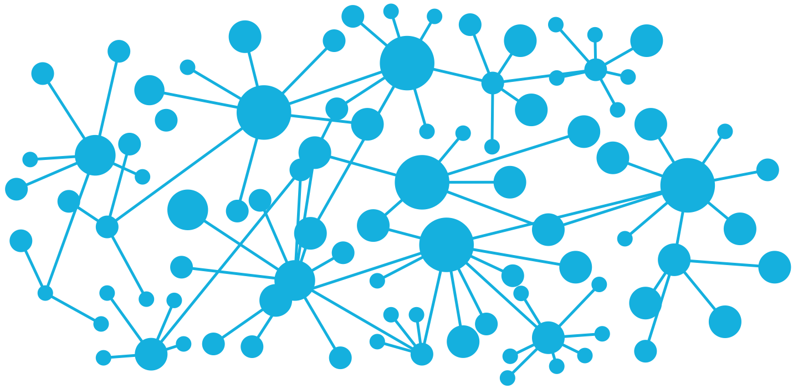

# Routing + Controllers in Sinatra

## Design Patterns

_In software engineering, a design pattern is a general repeatable solution to a commonly occurring problem in software design._

[Source Making: Design Patterns](https://sourcemaking.com/design_patterns)

## Model View Controller

One of the most common design patterns is called the Model-View-Controller design pattern

- **Model** - represents data
- **View** - houses your display logic
- **Controller** - retrieves structured data using a model and sends the data to the view so it can be presented to the user

**Note:** The controller is what glues between the model and the view

Examples Frameworks that use MVC
- Sinatra (ish?)
- Ruby on Rails
- Django
- Angular

## Enter Sinatra

_Sinatra provides us with a simple DSL (Domain Specific Language) to create a simple application server_

## Routes

[Routing Refresher](../32-web-frameworks-ruby/32-web-frameworks-ruby.md#introduction-to-routing)

```ruby
require "sinatra"

get "/users" do
  # this is often referred to as an index action
end

post "/users" do
  # this is often referred to as a create action
end

# the following routes are called dynamic routes
#   this route matches any path that begins with /users/
#   therefore it will match /users/14, /users/25, /users/1
put "/users/:id" do
  # this is often referred to as an update action

  # the text that comes after the /users/ will be stored
  #   in the params hash in the key params[:id]
  #   if the user hits the url /users/25 then params[:id] will
  #   be 25
  params[:id]
end

delete "/users/:id" do
  # this is often referred to as a delete/destroy action
end
```

## Redirects

_Sometimes we need to redirect a user to a different path on our server that accomplishes some other task_

### Scenario

_Imagine you are building an web application and you are allowing for someone to create a new user in your website. You would first create a route to respond to a new user request. Next, you would likely want to display the information for the user you just created. In order to do so you would create a route that responds to a request for a specific users information. Then you would redirect from the **create** action to this new user **show** action._

### Code

```ruby
post "/users/" do
  # create a user

  # redirect to the new user with id of [id number]
  redirect "/users/[id number]"
end

get "/users/:id" do
  # displays information regarding a user
end
```

## Exercises

**Preparation**:
- Create a new folder on your computer called `sinatra_app`
- Create two new files in that folder called `Gemfile` and `app.rb` respectively
- Add the following code to your `Gemfile:

```ruby
source "https://rubygems.org"

ruby "[Your current version of ruby]"

gem "sinatra"
```

- Run `bundle install` in the terminal
- Add the line `require "sinatra"` at the top of your `app.rb` file

_Note: To test your server, remember to run `ruby app.rb` in the terminal and check your website on the browser by navigating to `http://localhost:4567`._

### Shorter Exercises

1. In your `app.rb` file, create a `get` route that responds to the `"/"` path and returns `"Hello human, are you ready for us robots to take over!? |8-D|"`. Test your website in the browser.
2. Add a new `get` route in your `app.rb` file that responds to `"/sei"` and displays some custom text of your choosing
3. Create a variable in your `app.rb` file after the `require "sinatra"` statement but before the `get "/"` statement that sets the constant `NAME` equal to your name. Now add yet another `get` route in your `app.rb` file that responds to `"/my_name"` that displays the test `"Hello, my name is [your name here]"` where `"[your name here]"` is replaced with the value of the variable.
4. Create a variable storing a list of `names` with the following values `"edward elric (alchemist / pokemon master)", "ronnie the html G.O.A.T", "team rocket", "yorvin the dominican", "marria the edgecase queen"` in your `app.rb` file. Write some code to display all their names in a new `get` route of your choosing.

### Longer Exercise

1. Create a new file called `classmate.rb`.
2. In this file create a `class` called `Classmate` that stores a classmates `name` and `super_power`. Objects of type `Classmate` can also display their `name` and `super_power` in an interesting way within a method `i_have_the_power!`.
3. Now require this file in `app.rb`.
4. Create some classmate objects before your routes and store them in some variables.
5. Create three `get` routes with the pathnames representing their names. (e.g. `get "/orlando"`, `get "/chris"`)
6. In each action, try displaying each classmates name and super power by utilizing the `i_have_the_power!` methods on each object within each of the routes. (e.g. `get "/orlando"` would utilize the `i_have_the_power!` method on an `orlando` object I created beforehand)

### Challenge Exercises

1. If I wanted to store all classmates in a container / collection style object, what would I need to create in order to enable this behavior
2. Write code to display all prior classmates name and super power in one new route
3. Write code to allow for one route to be able to dynamically display data on a classmate based on name

## Workshop

[Joke Generator](https://drive.google.com/open?id=11lIqT5pbMEB7lWcNYC7OJz2YReK3a1BdC6bDUvhqLow)