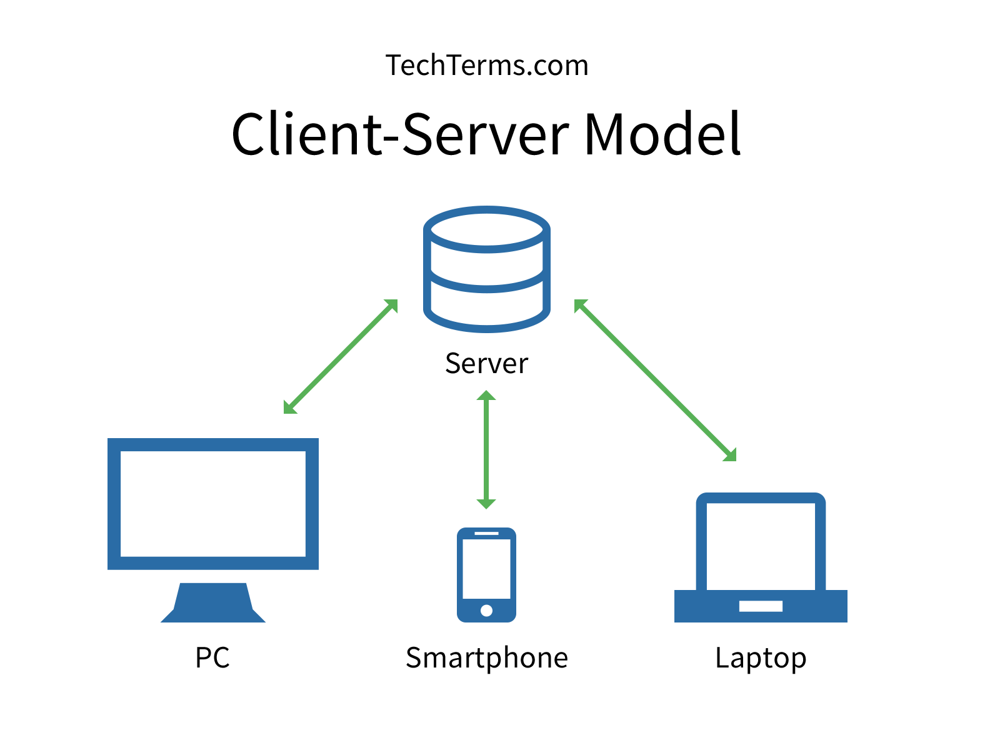

# How the Web Works



## Webpage Basics

_Web development is divided into two major categories: **Client Side Programming** and **Server Side Programming**_

Client Side Programming
- HTML
- CSS
- JavaScript

Server Side Programming
- Ruby
- Python
- PHP
- Java
- Go

## Workspace Setup

### Folders

_Use folders to organize / group your projects into buckets that are related_

#### Examples
- All projects should be in a top level **projects** folder
- Each project should be stored in its own individual folder

### Naming conventions

- Avoid using spaces for folder / filenames
- Replace spaces with dashes or underscores
- Choose descriptive names

### Understanding your text editor

The following are editors I recommend
- Vscode
- Atom
- Sublime
- Brackets

Train yourself in how to accomplish following common tasks:
- Opening + Closing a file
- Copy + Paste
- Undo
- Redo
- Search
- Search + Replace
- Global Search + Replace
- File Search
- Installing Software
- Changing your theme

## HTML Review


### Top Level Structure

- `<head>`
- `<body>`

### Elements

Text
- `<h1>` - `<h6>`
- `<p>`
- `<quote>`
- `<a>`

Lists
- `<ul>`
- `<ol>`
- `<li>`

Media
- ``
- `<audio>`
- `<video>`

Input
- `<forms>`
  - `<select>`
  - `<option>`
  - `<input>`
    - `<input type="text">`
    - `<input type="email">`
    - `<input type="date">`
    - `<input type="radio" name="grouping">`
    - `<input type="checkbox">`

General
- `<span>`
- `<div>`

### Common Attributes

- `src`
  - defines the source of a image
  - used with `img`
- `href`
  - defines where an anchor points to
  - used with `a`
- `title`
  - defines tooltip text
  - used with many elements
- `alt`
  - defines alternate text to be displayed when images are disabled
  - used with `img`

[MDN: HTML Elements](https://developer.mozilla.org/en-US/docs/Web/HTML/Element)

### Understanding Folders

#### Windows

_Files in windows start with a drive letter and use backslashes to denote separation between nested folders and files_

Examples
- C:\\\Windows\System32\delete-me-plz.dll
- D:\\\cool-tunes\the-dopest-track.mp3
- E:\\\steamapps\greatest-game-of-all-time.exe

#### Unix

_Files in unix systems begin with a root "/" and use forward slashes to denote separation between nested folders and files_

Examples
- /home/orlandocaraballo/documents/readme.txt
- /etc/file.conf
- /tmp/1829h218h213n812h3n8m123

### File pathing

#### Absolute

_References a file by using the exact location of where it exists in the file system_

#### Relative

_References a file by using the location of a file / folder relative to the current folder_

Examples
- ../


### HTML Best Practices
Proper nesting
Proper tag usage (Semantic HTML)
Spacing

## Accessibility

_Accessibility is the process by which you create a website that viewable by a variety of different client bases including but not limited do: desktop browsers, mobile browsers, and screen readers_

[What is a Screen Reader](https://www.nomensa.com/blog/2005/what-screen-reader)

The main method used to make your site accessible is by writing what is referred to as semantic hTML.

### Semantic HTML

_Semantic HTML means using correct HTML elements for their correct purpose as much as possible. Semantic elements are elements with a meaning; if you need a button, use the **\<button\>** element (and not a **\<div\>**)._

### Proper Tagging

#### HTML5 tags

##### Top Level Tags
- `<header>` - houses the header content of a page 
- `<nav>` - houses the page navigation
- `<aside>` - houses content that is related but not the main content of the page
- `<main>` - houses the main content of the page
- `<footer>` - houses the content that extraneous but necessary for the page (copyright, extra links)

```html
<html>
<head>
</head>
<body>
  <header>
    <h1>Header</h1>
  </header>
  <nav>
    <ul>
      <li><a href="/">Home</a></li>
      <li><a href="/our-team">Our team</a></li>
      <li><a href="/projects">Projects</a></li>
      <li><a href="/contact">Contact</a></li>
      </ul>
  </nav>
  <main>
    <article>
      <h2>Article heading</h2>

      <p>
        Lorem ipsum dolor sit amet, consectetur adipisicing elit. Donec a diam lectus. Set sit amet ipsum mauris. Maecenas congue ligula as quam viverra nec consectetur ant hendrerit. Donec et mollis dolor. Praesent et diam eget libero egestas mattis sit amet vitae augue. Nam tincidunt congue enim, ut porta lorem lacinia consectetur.
      </p>

      <h3>subsection</h3>

      <p>
        Donec ut librero sed accu vehicula ultricies a non tortor. Lorem ipsum dolor sit amet, consectetur adipisicing elit. Aenean ut gravida lorem. Ut turpis felis, pulvinar a semper sed, adipiscing id dolor.
      </p>

      <p>
        Pelientesque auctor nisi id magna consequat sagittis. Curabitur dapibus, enim sit amet elit pharetra tincidunt feugiat nist imperdiet. Ut convallis libero in urna ultrices accumsan. Donec sed odio eros.
      </p>

      <h3>Another subsection</h3>

      <p>
        Donec viverra mi quis quam pulvinar at malesuada arcu rhoncus. Cum soclis natoque penatibus et manis dis parturient montes, nascetur ridiculus mus. In rutrum accumsan ultricies. Mauris vitae nisi at sem facilisis semper ac in est.
      </p>

      <p>
        Vivamus fermentum semper porta. Nunc diam velit, adipscing ut tristique vitae sagittis vel odio. Maecenas convallis ullamcorper ultricied. Curabitur ornare, ligula semper consectetur sagittis, nisi diam iaculis velit, is fringille sem nunc vet mi.
      </p>
    </article>
    <aside>
      <h2>Related</h2>
      <ul>
        <li><a href="#">Oh I do like to be beside the seaside</a></li>
        <li><a href="#">Oh I do like to be beside the sea</a></li>
        <li><a href="#">Although in the North of England</a></li>
        <li><a href="#">It never stops raining</a></li>
        <li><a href="#">Oh well...</a></li>
      </ul>
    </aside>
  </main>
  <footer>
    <p>©Copyright 2050 by nobody. All rights reversed.</p>
  </footer>
</body>
</html>
```

##### HTML Attributes


`alt`

```html

```


`title`

##### Extras
- `<strong>` vs `<b>`
- `<em>` vs `<i>`

[HTML5 Elements](https://www.w3schools.com/html/html5_new_elements.asp)

[MDN: Accesibility](https://developer.mozilla.org/en-US/docs/Learn/Accessibility/HTML)

## Workshop

[Band Camp](https://drive.google.com/open?id=10-wF1RImdLqQcx9UFgudbFBItvO6IORkDR6CX-FvETM)
