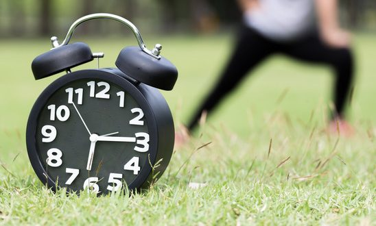

# Morning Exercise

1. Create a function named `stringifyLine` that accepts two parameters `startingCoordinates` and `endingCoordinates`. Assume both parameters are objects each with two keys `x` and `y`. Return a string that states "{([start x],[start y]) - ([end x],[end y])}".

```js
stringifyLine({ x: 3, y: 2 }, { x: 18, y: -3 }) // {(3,2) - (18,-3)}
stringifyLine({ x: 15, y: 2 }, { x: 100, y: 14 }) // {(15,2) - (100,14)}
stringifyLine({ x: -78, y: -90 }, { x: 1, y: 1 }) // {(-78,-90) - (1,1)}
```

**Note: [start x] and [start y] represent the values of the keys within the starting coordinates / ending coordinates**

2. Create another function named `translatePoint` that accepts two parameters `startingCoordinates` and `amountToMoveBy` that moves the point identified by `startingCoordinates` by the amount indicated in `amountToMoveBy`. Assume `startingCoordinates` is an object with two keys `x` and `y`. Return an object with the new coordinates for `x` and `y`.

```js
translatePoint({ x: 10, y: 8 }, 4) // { 14, 12 }
translatePoint({ x: -15, y: -900 }, 20) // { 5, 880 }
translatePoint({ x: 14, y: 2 }, -9) // { 5, -7 }
```

## Challenge:

3. Create a function named `createLineAndStringify` that two parameters `startingCoordinates` and `amountToMoveBy` that creates a line by taking the point identified by `startingCoordinates`, moving that point by the amount indicated in `amountToMoveBy` assuming the result is the end point of a line. The return value is a string that states "{([x],[y]) - ([x],[y])}" which are the start and end points of the line.

```js
createLineAndStringify({ x: 10, y: 8 }, 4) // {(10,8) - (14, 12)}
createLineAndStringify({ x: -15, y: -900 }, 20) // {(-15, -900) - (5, 880)}
createLineAndStringify({ x: 14, y: 2 }, -9) // {(14, 2) - (5, -7)}
```

**Note: Remember to try to keep your code DRY (Don't repeat yourself)**

4. Let's go deeper! We can take this even further. Right now `createLineAndStringify` creates a line and returns the result as a string. Can you think of a way we can allow the modification of the location of the startingCoordinates one more time, without defining that specific behavior in the original function.