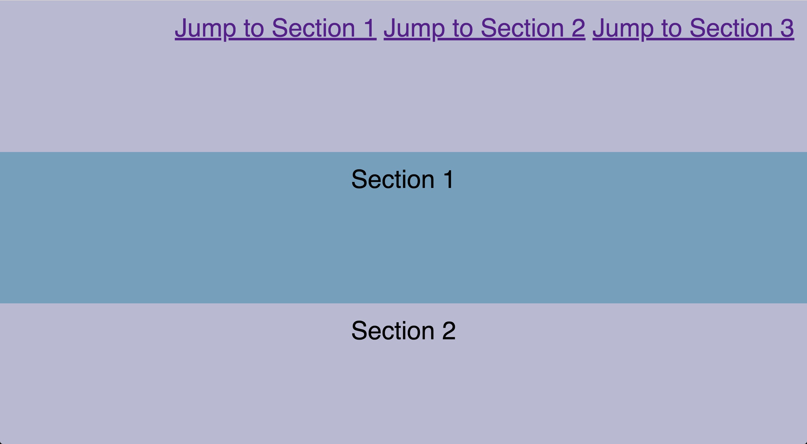
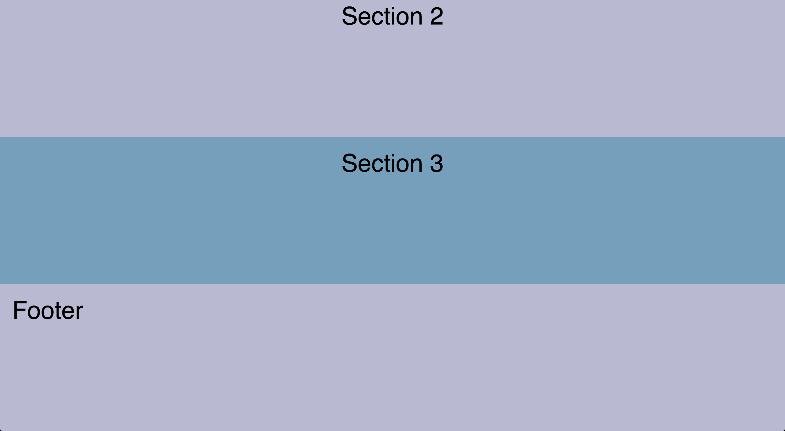

# Morning Exercise

Create a one page website, using semantic html (using `header`, `main`, `footer` tags as top level elements) where within the `main` tag you have 3 `section` elements.

Content & Structure:
- Each section should have an `id` starting with `section-[section-number]` (e.g the first section should have an `id` of `section-1`, the second section should be `section-2`, etc)
- The `section` elements should have the text "Section 1", "Section 2", "Section 3" respectively within each element. 
- The `header` should have a `nav` element nested within it 
- The `nav` should have 3 links nested within it where the anchor text should say "Jump to Section 1", "Jump to Section 2", "Jump to Section 3" respectively. When clicked each anchor should jump to the matching section. (e.g "Jump to Section 2 should jump to the section with `id="section-2"`)
- The `footer` should just have the text "Footer" within it

Design Requirements:
- The `header`, `section` and `footer` elements should have a height of `600px` and occupy the entire window width
- The `header`, 3 `section`, and `footer` elements should alternate background colors between `#759FBC` (light-blue) and `#B9B8D3` (light-purple)
- Each section should have `center` aligned text
- The `header`, `section` and `footer` elements should have a `font-size` of `40px`,`font-family` of `sans-serif` and `20px` of padding
- The `header` should have `right` aligned text
- The `footer` should have `center` aligned text
- The text `color` should be `#fff` when the background is light-blue and should be `#1F2D3D` when the background color is light-purple

The end result should look something like this:

