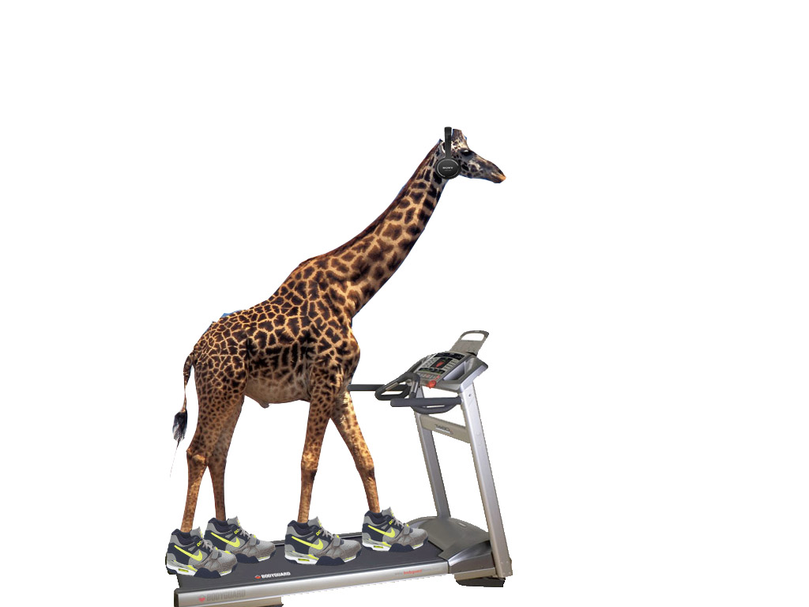

# Morning Exercise

1. Create an `class` named `Animal` that has the following instance variables (properties):
- `height` - number (assume the number represents ft)
- `weight` - number (assume the number represents lbs)
- `type` - string representing the type of animal
- `gender` - string representing the gender

It should have the following method:
- `displayHeightAndWeight()`
    - accepts no parameters
    - returns the concatenated `height` and `weight` as a string separate by a  `" : "`

## Example

```js
let spider = new Animal(0.1, 3, "spider", "female")
spider.height // 0.1
spider.weight // 3
spider.type // "spider"
spider.female // "female"
spider.displayHeightAndWeight() // 0.1ft : 3lb
```

2. Create a `class` named `Giraffe` that `extends` `Animal` and has the following instance variables (properties):
- `height` - number (assume the number represents ft)
- `weight` - number (assume the number represents lbs)
- `type` - string representing the type of animal (is always set to `"giraffe"`)
- `gender` - string representing the gender
- `neckLength` - number (assume the number represents ft)

This class should have the following methods:
- `extendNeck(length)` 
    - accepts 1 parameter `length`
    - increases the `neckLength` and by the amount indicated by `length`
- `shrinkNeck(length)` 
    - accepts 1 parameter `length`
    - reduces the neckLength by the amount indicated by `length`

## Example

```js
let giraffe = new Giraffe(15, 1750, "female", 7)
giraffe.height // 15
giraffe.weight // 1750
giraffe.type // "giraffe"
giraffe.female // "female"
giraffe.neckLength // 7
giraffe.displayHeightAndWeight() // 15ft : 1750lb

giraffe.extendNeck(2)
giraffe.neckLength // 9
giraffe.shrinkNeck(5)
giraffe.neckLength // 4
```

## Challenge

A giraffe's neck is a part of its body, therefore when you decrease or increase its `neckLength` it should also change its `height`. What logic would you use to change its `height` based on a change in its `neckLength`? When we increase the `neckLength` what checks should we have in place to prevent it from being too short or too large?