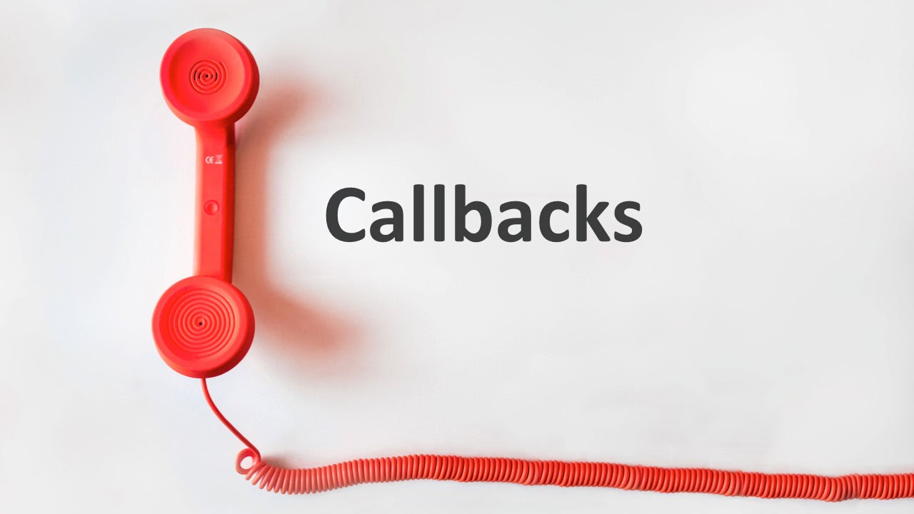

# Callbacks, Closures, Promises

## Callbacks

_A callback function is a function that is passed in as an argument to another function. This function argument can be executed within the the scope of the enclosing function at any time_

```js
function sum(operand1, operand2) {
  return operand1 + operand2
}

function subtract(operand1, operand2) {
  return operand1 - operand2
}

function calculate(operand1, operand2, operation) {
  return operation(operand1, operand2)
}

// subtracts 5 from 4
calculate(4, 5, subtract) // -1

// adds 10 to 10
calculate(10, 10, add) // 20

// we are providing the calculator function with operands and
// we have defined an anonymous function that uses those values to do something unique
calculate(1, 2, (operand1, operand2) => {
  return (operand1 * operand2) + 10
}) // 12
```

[Codeburst: What the heck is a Callback?](https://codeburst.io/javascript-what-the-heck-is-a-callback-aba4da2deced)

## Closures

_A closure is an inner function that has access to the outer (enclosing) function’s variable scope_

```js
function outerFunction() {
  let outerNum = 29

  // this inner function has access to
  //  the outerNumber's scope
  // this behavior is called a closure
  function innerFunction() {
    return outerNum + 1000
  }

  return innerFunction()
}

outerFunction() // 1029
```

```js
function closureGenerator() {
  let i = 1

  return function() {
    console.log(i)
  }
}

let closure = closureGenerator()
closure() // logs 1 to the console
```

[Freecodecamp: Javascript closures, In plain English please](https://medium.freecodecamp.org/whats-a-javascript-closure-in-plain-english-please-6a1fc1d2ff1c)

## Promises

_A promise is an object that may produce a single value some time in the future_

```js
// setTimeout gives us the ability to execute some behavior after a certain amount of time has elapsed (in milliseconds)
// in this case it will display hello world after 5 seconds have elapsed
setTimeout(() => { 
  console.log("hello world")
}, 5000)

// resolve and reject are two callbacks
// in this example we can see that the resolve and reject callbacks are passed into the setTimeout argument

// when this promise is created, we need to provide it with the ability to dictate when the setTimeout has finished executing and whether it is a success of failure; resolve and reject represent functions that would execute when the promise has finished executing successfully or when it has failed

// in this case, the promise can only succeed therefore when 5 seconds have elapsed, it will execute the resolve function which lets us know that the promise has been resolved
var promise1 = new Promise((resolve, reject) {
  setTimeout(resolve, 5000);
});
```

[Medium: What is a Promise?](https://medium.com/javascript-scene/master-the-javascript-interview-what-is-a-promise-27fc71e77261)