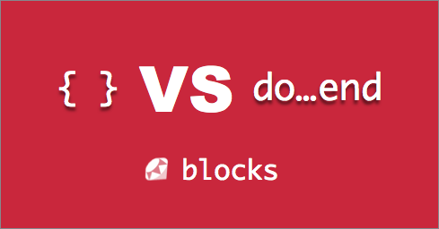

# Blocks, Procs, Lambdas

The following are examples of blocks

```ruby
# multiline block
(1..10).each do |item|
  puts item
end

# single line block
%w{I wanna be the guy}.each { |word| puts word }
```

We can define our own blocks

```ruby
# we define a function here that will eventually
#   utilize a block
def block_example
  yield
end

# this next line invokes the prior function while passing it a block
block_example { puts "I am running this code within the function" }
```

We can also pass arguments into blocks

```ruby
# we define a function here that will eventually
#   utilize a block and passes it an argument 5
def block_example_with_args
  yield(5)
end

# this next line invokes the prior function while passing it a block
#   in this case `number` will always be assigned the value of 5
block_example_with_args do |number| 
  puts "the number I am being passed in is #{number}"
end
```

If we run `yield` without there being a block....

```ruby
def block_example_check_block
  yield(5)
end

# however it causes an error
block_example_check_block # this cause return an error
```

We should check if a block is given before yielding

```ruby
# block_given? checks to see if a block was passed in
def block_example_check_block
  yield(5) if block_given?
end

# when I run this function without a block it won't give an error
block_example_check_block
```
## Procs

Procs allow us to store a block within an object

```ruby
say_hello = Proc.new { puts "Hello!" }

# or 

say_hello_again = Proc.new do
  puts "Hello again!"
end
```

Alternate Syntax

```ruby
# because its ruby.. we have alternate syntax
say_hello = proc { puts "Hello!" }

# or 

say_hello_again = proc do
  puts "Hello again!"
end
```

### Invoking a Proc

```ruby
times_three = proc { |num| num * 3 }

times_three.call(5) # 15
```

You can pass in a proc into a function by passing in the name

```ruby
add_five = proc { |num| num + 5 }

def run_proc(proc_param)
  proc_param.call(10)
end

run_proc(add_five) # 50
```

You can pass in a proc (as a block) into a function using `&`

```ruby
add_five = proc { |num| num + 5 }

[1,2,3,4].map(&add_five) # [6, 7, 8, 9, 10]
```

## Lambdas

Lambdas are essentially procs but with some added special sauce:

```ruby
# lambdas cannot execute if you do not pass in the correct
#   number of arguments
# below we create a lambda that requires one argument
times_seven = lambda { |num| num * 7 }

# this will give us an error
times_seven.call

# if we were to create a proc however
times_eight = proc { |num| num * 8 }

# this would not give an error
times_eight.call
```

```ruby
# btw there is also an alternate syntax for lambdas /shrug
times_seven = -> { |num| num * 7 }
```

_Note: Please read Part 2 article for a more thorough explanation of the differences between a proc and a lambda_

## Resources

- [Medium: What the heck are blocks, procs and lambdas - Part 1](https://medium.com/@sihui/what-the-heck-are-code-blocks-procs-lambdas-and-closures-in-ruby-2b0737f08e95)
- [Scopes, Universes, & Lunch Boxes; Procs vs Lambdas in Ruby - Part 2](http://www.sihui.io/procs-in-ruby-p2/)