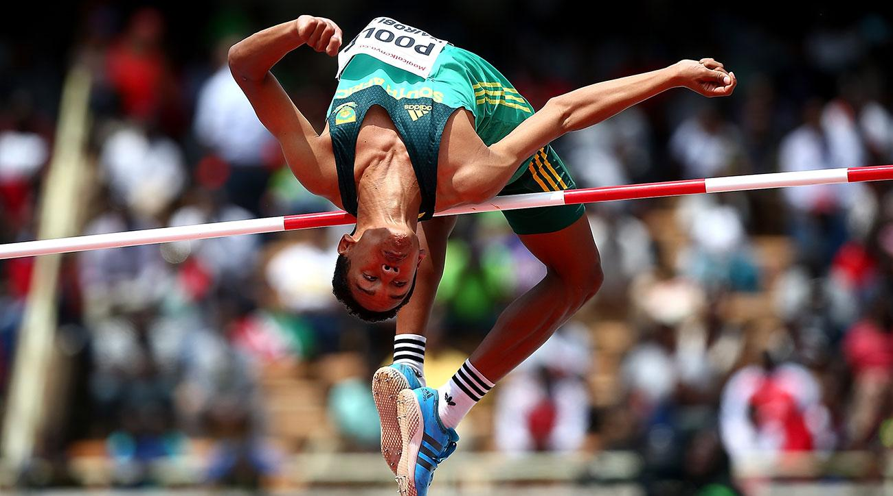

# Morning Exercise

Open the file, [animals.txt](animals.txt), in ruby and gather all the attributes from the file then store them in an animal object with the following attributes. Try using this [method](https://ruby-doc.org/core-2.1.0/IO.html#method-c-readlines) to read file lines contents.

```ruby
type
height
gender
weight
```

**Note:** Assume file contents attributes are in the same order.