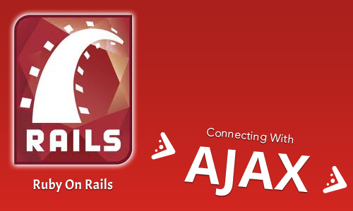

# AJAX


## Javascript Review

As a review, remember that javascript is loaded onto the page within the `views/layouts/application.html.erb` file. All prior idiosyncracies of javascript still apply:

1. Remember to load your js libraries before using them in the code
2. Remember to use `DOMContentLoaded` as an event listener in your code
    - Yes you can drop your code at the bottom of the page but Rails warns you about this because some oddities with Turbolinks
3. Remember to attach your event listeners to your buttons, links or other html elements you wish to target

## JSON Review

Just in case you forgot, here is an example of a standard piece of json code:

```js
animals: [
  { type: "giraffe", name: "gaf the giraffe", age: 52 },
  { type: "elephant", name: "benefit the elephant", age: 98},
  { type: "turtle", name: "squirtle the turtle", age: 33}
]
```

Remember, that usually the most effective way to communicate using from the frontend and backend is to pass around json code that represents data.

## AJAX Review

As another refresher, AJAX is mechanism for communicating asynchronously with the backend via javascript on the frontned. All of this happens without reloading the page. The server is resposible for generating json code to respond to the client with on the frontend.

## Axios Review

Axios is the library we will be using to make asynchronous javascript calls to our backend. The code looks as follows:

```js
axios({
  method: '[http method]', 
  url: '[endpoint url]',
})
.then((response) => {
  // where response.data represents the data we receive from the server
  console.log(response.data)
})
.catch((error) => {
  // where error represents an error that occured
  console.log(error)
})
```

For a more thorough explanation of ajax please refer to the js lecture on ajax [here](../17-working-with-ajax/17-working-with-ajax.md).

## Assets in Rails

Remember, assets in RoR are managed by asset pipeline. It handles concatenation, aggregation, preprocessing, cache busting and many other things. When creating javascript files, make sure to place them within the `/app/assets/javascripts` directory in your RoR app.

Things to remember:
- Asset pipeline loads all assets on all pages
- Be aware of name collision
- Design JS code to run only when a specific class / id is found on the page

## Executing Ajax

When managing AJAX requests in RoR there are several methods we could employ:

Covered today:
- Axios
- Rails UJS

Not covered today:
- JS Fetch
- jQuery (not included by default in more recent versions of RoR)

## Axios
- Is more transferable across platforms
- CSRF token is not automatically added
- Use the CDN not the npm package
- Remember to set CSRF token header


Let's walk through an axios example:

```ruby
# /config/routes.rb
get "/users", to: "users#index"
```

```ruby
# /app/controllers/users_controller.rb
class UsersController < ApplicationController
  def index
    @users = User.all

    # these indicate what formats this action responds to
    respond_to do |format|
      # when responding to a html request, it will respond by
      #   generating the html from the template located at: /app/views/users/index.html.erb
      format.html

      # when responding to a json request, it will respond by
      #   generating json
      format.json { render json: @users }
    end
  end
end
```

```js
// /app/assets/javascripts/users.js

// used to get around the race condition issue
document.addEventListener('DOMContentLoaded', domContentLoadedEvent => {
  // gets reference to the button element on the page
  let button = document.querySelector('button')

  // sets up the click event handler when clicking the button
  button.addEventListener('click', clickEvent => {

    // makes the axios call
    axios({
      method: 'get', 
      url: '/users',
      // use the following only if you making an POST, PUT / PATCH, DELETE
      // data: {
      //   id: 6
      // },
      headers: {
        // these two are required in order for the request to work
        'X-CSRF-Token': document.querySelector("meta[name=csrf-token]").content,
        // lets Rails know this is going to be an AJAX request
        'X-Requested-With': 'XMLHttpRequest'
      }
    })
    .then((response) => {
      // this is what executes when the request is successful
      let users = response.data.users
      let usersUl = document.querySelector("ul#users")

      users.forEach(user => {
        let userLi = document.createElement("li")

        userLi.id = user.id
        userLi.innerHTML = user.name

        usersUl.appendChild(userLi)
      })
    })
    .catch((error) => {
      // this is what executes when the request is unsuccessful
      console.log(error)
    })
  })
})
```

## Rails UJS (Using JSON Response)
- Enabled by default in Rails
- Specific to Rails

Here's an example using UJS syntax (the controller and route are the same):

```js
// /app/assets/javascripts/users.js

document.addEventListener('DOMContentLoaded', domContentLoadedEvent => {
  // gets reference to the button element on the page
  let button = document.querySelector('button')

  // sets up the click event handler when clicking the button
  button.addEventListener('click', clickEvent => {

    // makes the ujs call
    Rails.ajax({
      type: 'get', 
      url: '/users',
      // use the following only if you making an POST, PUT / PATCH, DELETE
      // data: {
      //   id: 6
      // },
      success: (response) => {
        // this is what executes when the request is successful
        let users = response.users
        let usersUl = document.querySelector("ul#users")

        users.forEach(user => {
          let userLi = document.createElement("li")

          userLi.id = user.id
          userLi.innerHTML = user.name

          usersUl.appendChild(userLi)
        })
      },
      error: (error) => {
        // this is what executes when the request is unsuccessful
        console.log(error)
      }
    })
  })
})

```

### Rails UJS (Using Remote True)

- Enabled by default in Rails
- Specific to Rails
- Reduces the amount of JS code that needs to be written
- Can be cumbersome to work with

When making UJS AJAX calls we can also choose to respond with javascript code:

```erb
<%= link_to "Get Users", "/users", remote: true %>
```

```ruby
# /app/controllers/users_controller.rb
class UsersController < ApplicationController
  def index
    @users = User.all

    # these indicate what formats this action responds to
    respond_to do |format|
      # when responding to a html request, it will respond by
      #   generating the html from the template located at: /app/views/users/index.html.erb
      format.html

      # when responding to a json request, it will respond by
      #   generating js code
      # notice how we are not responding with any instance variables at this point
      # this will respond by generating the js from the template located at:
      #   /app/views/users/index.js.erb
      format.js
    end
  end
end
```

```js
// /app/views/users/index.js.erb

let usersUl = document.querySelector("ul#users")
let userLi = null

// yes this is possible
//    1. the ruby code is executed and generates the js
//    2. the js is sent to the frontend
<% @users.each do |user| %>
  userLi = document.createElement("li")
  
  userLi.id = "user-<%= user.id %>"
  userLi.innerHTML = "<%= user.name %>"

  usersUl.appendChild(userLi)
<% end %>
```

^ this method can be confusing, pick the method that makes the most sense to you and use that

## Use Cases for AJAX
- Submitting a form without reloading the page
- Loading up potentially slow loading database queries on demand

**Note:** Disable submit boxes on click and reenable on return

## Turbolinks

_Turbolinks is a mechanism by which RoR apps can load only portions of the webpage using javascript namely the `head` and `body` tags without doing an entire page refresh_

Benefits
- Speeds up page delivery

Caveats
- May cache css / js code
